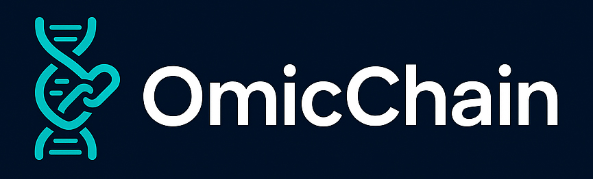

# 🧬 OmicChain



**Proof of Integrity for Bioinformatic RNASeq Pipeline**

OmicChain is a software that bridges bioinformatics and blockchain technology, providing immutable proof of integrity for RNASeq analysis pipelines. By combining automated workflow execution with blockchain certification and NFT minting, OmicChain ensures complete traceability and verifiability of scientific results.

[](https://www.gnu.org/licenses/gpl-3.0)
[](https://www.python.org/)
[](https://streamlit.io/)

## ✨ Features

- 🔬 **Automated RNASeq Pipeline**: Execute complete differential expression analysis using Snakemake and DESeq2
- 🔐 **Cryptographic Integrity**: Generate SHA-256 hashes for pipeline components and results
- ⛓️ **Blockchain Certification**: Publish analysis proofs on Base blockchain (Mainnet or Testnet)
- 🎨 **NFT Minting**: Create NFTs certifying your analysis results with IPFS metadata storage
- 📊 **Comprehensive Outputs**: Generate heatmaps, volcano plots, GO/KEGG enrichment analyses
- 🖥️ **User-Friendly Interface**: Streamlit-based web interface for seamless workflow execution

## 🎯 Use Cases

- **Reproducible Research**: Ensure your RNASeq analyses are verifiable and traceable
- **Scientific Integrity**: Create immutable proof of your computational methods
- **Data Provenance**: Track the complete lifecycle of your bioinformatic workflows
- **Regulatory Compliance**: Meet requirements for transparent and auditable analyses
- **Collaborative Science**: Share certified results with confidence

## 📋 Requirements

### Software Dependencies

**Python packages:**
```bash
pip install streamlit web3 python-dotenv requests pandas pillow
```

**Snakemake:**
```bash
mamba install -c bioconda snakemake
```

**R dependencies:**
```r
install.packages(c("pheatmap", "RColorBrewer", "tibble", "dplyr", "ggplot2"))
BiocManager::install(c("DESeq2", "clusterProfiler", "org.Hs.eg.db", "tiff"))
```

### Required Project Files

Ensure these files are in your project directory:
- `Snakefile` - Snakemake workflow definition
- `run_deseq2.R` - DESeq2 analysis script
- `contract_abi_proof.json` - ABI for blockchain proof contract
- `contract_abi_nft.json` - ABI for NFT contract
- `omicchain_banner.jpg` - UI banner image
- `.env` - Configuration file (see below)

### Blockchain Requirements

**Wallet Setup:**
- Any EVM-compatible wallet (MetaMask, Rabby, Base Wallet)
- Wallet address and private key

**ETH Funds:**
- **Mainnet**: Real ETH on Base network for gas fees
- **Testnet**: Free testnet ETH from [Alchemy Base Sepolia Faucet](https://www.alchemy.com/faucets/base-sepolia)


## ⚙️ Configuration

**Infura and Pinata keys:**
Create accounts and get your keys to complete your .env file

Create a `.env` file in your project directory:

```env
# IPFS/Pinata Configuration
PINATA_API_KEY=your_pinata_api_key
PINATA_API_SECRET=your_pinata_secret_key

# Wallet Configuration
PRIVATE_KEY=your_wallet_private_key
ACCOUNT_ADDRESS=your_wallet_address

# RPC Endpoints (Infura)
INFURA_URL_MAINNET=https://base-mainnet.infura.io/v3/your_project_id
INFURA_URL_TESTNET=https://base-sepolia.infura.io/v3/your_project_id

# Smart Contracts
CONTRACT_PROOF_ADDRESS_MAINNET=0x...
CONTRACT_PROOF_ADDRESS_TESTNET=0x...
CONTRACT_NFT_ADDRESS_MAINNET=0x...
CONTRACT_NFT_ADDRESS_TESTNET=0x...
```

⚠️ **Security Warning**: Never commit your `.env` file to version control. Add it to `.gitignore`.

## 🚀 Quick Start

1. **Clone the repository:**
```bash
git clone https://github.com/ProDiCeT/OmicChain.git
cd OmicChain
```

2. **Install dependencies:**
```bash
pip install -r requirements.txt
```

3. **Configure your `.env` file** with your credentials

4. **Launch OmicChain:**
```bash
streamlit run OmicChain.py
```

5. **Access the interface** at `http://localhost:8501`

## 📖 Usage Workflow

### 1. Execute Pipeline
- Upload your Snakefile and R script
- Provide expression table (TSV format supplied in the repository as example but you can generate a new one with count_matrix_generator.py and adjust settings)
- Select control and treatment samples
- Execute the automated pipeline

### 2. Publish Blockchain Proof
- Select Base Mainnet or Testnet
- Publish the combined hash to the blockchain
- Receive transaction confirmation and block number

### 3. Mint NFT Certificate
- Provide recipient address
- Mint NFT with embedded pipeline metadata
- View your certified analysis on OpenSea

## 📊 Pipeline Outputs

All results are generated in the `/results` folder:
- `heatmap.png` - Expression heatmap
- `volcano_plot.png` - Differential expression volcano plot
- `go_enrichment.png` - GO enrichment analysis
- `kegg_enrichment.png` - KEGG pathway enrichment
- `top_genes.tsv` - Top 1000 differentially expressed genes
- `combined_figures.png` - Combined visualization for NFT
- `report.pdf` - Complete analysis report
- Hash files for integrity verification

## 🔗 Blockchain Integration

OmicChain integrates with:
- **Base Blockchain** (Ethereum Layer 2)
- **IPFS** via Pinata for decentralized storage
- **Smart Contracts** for proof publication and NFT minting
- **OpenSea** for NFT visualization

## 🏗️ Architecture

```
OmicChain
│
├── Data Input Layer
│   ├── Snakefile
│   ├── R Scripts
│   └── Expression Data
│
├── Processing Layer
│   ├── Snakemake Workflow
│   ├── DESeq2 Analysis
│   └── Visualization
│
├── Integrity Layer
│   ├── SHA-256 Hashing
│   └── Hash Aggregation
│
├── Blockchain Layer
│   ├── Base Network
│   ├── Smart Contracts
│   └── Transaction Management
│
└── Certification Layer
    ├── IPFS Storage
    ├── NFT Minting
    └── Metadata Generation
```

## 👥 Contributing

Contributions are welcome! Please feel free to submit a Pull Request. For major changes, please open an issue first to discuss what you would like to change.

## 📄 License

This software is licensed under the GNU LGPL v3.
© 2026 Pierre-Olivier Guichet / UR24144 ProDiCeT, University of Poitiers

## 📬 Contact

**Author**: Pierre-Olivier Guichet, PhD  
**Email**: pierre-olivier.guichet@inserm.fr  
**Institution**: UR24144 ProDiCeT, University of Poitiers

## 🙏 Acknowledgments

- Snakemake workflow management system
- DESeq2 for differential expression analysis
- Base blockchain for scalable Layer 2 infrastructure
- Pinata for IPFS infrastructure
- Streamlit for the web interface

## 📚 Citation

If you use OmicChain in your research, please cite:

```bibtex
@software{omicchain2026,
  author = {Guichet, Pierre-Olivier},
  title = {OmicChain: Proof of Integrity for Bioinformatic RNASeq Pipeline},
  year = {2026},
  url = {https://github.com/UR24144-ProDiCeT/OmicChain},
  version = {1.0}
}
```

## 🗺️ Roadmap

- [ ] Support for additional blockchain networks
- [ ] Integration with more bioinformatic pipelines
- [ ] Enhanced NFT metadata standards
- [ ] Multi-omics support (Genomic, proteomic, metabolomic)
- [ ] Decentralized storage options

---

**Made with love for open and reproducible science**
